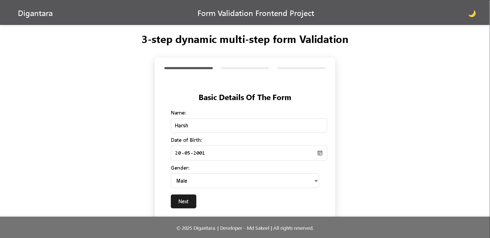
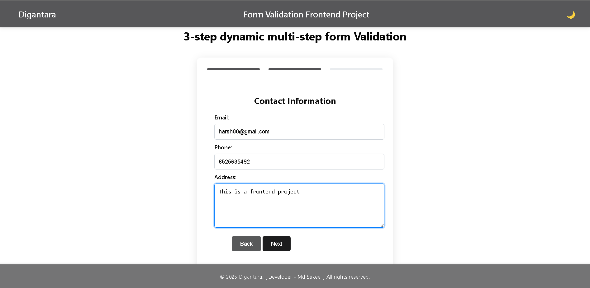
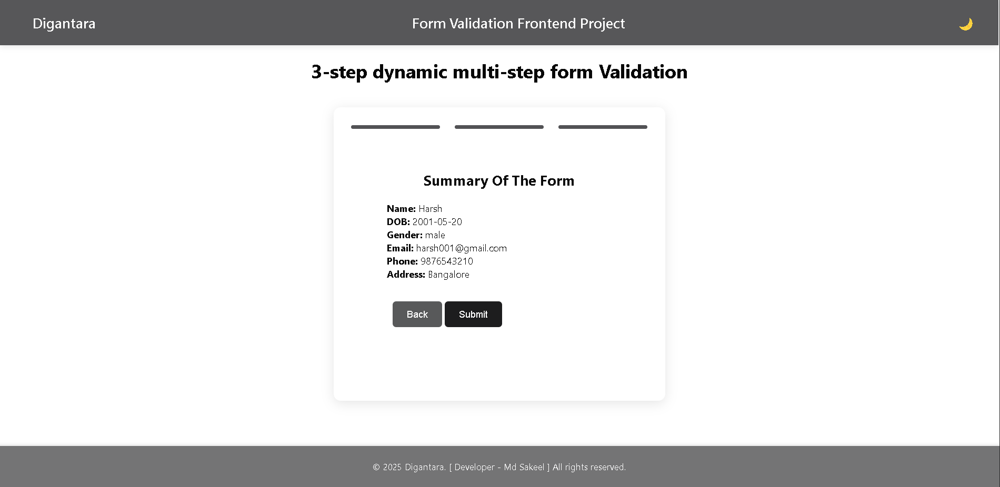
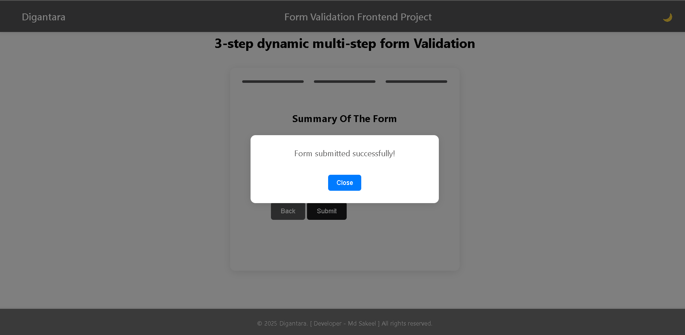
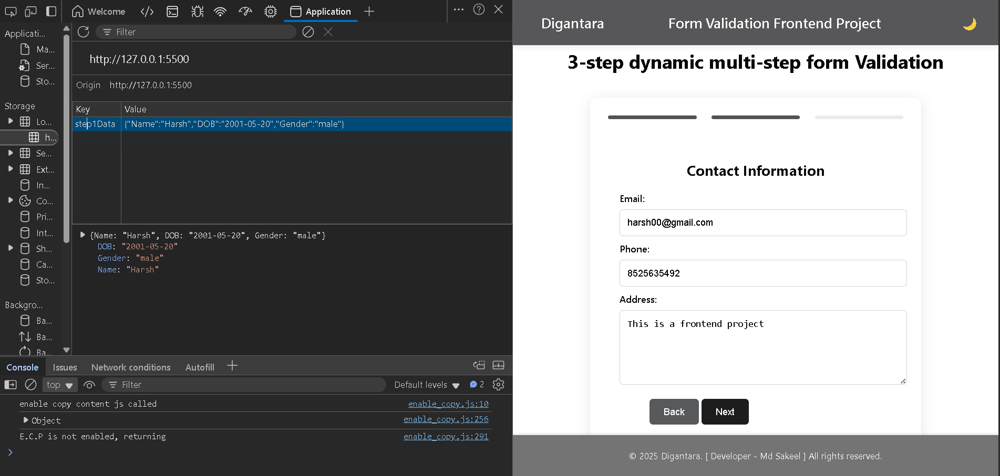
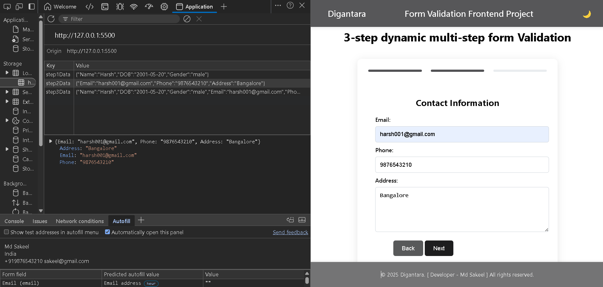
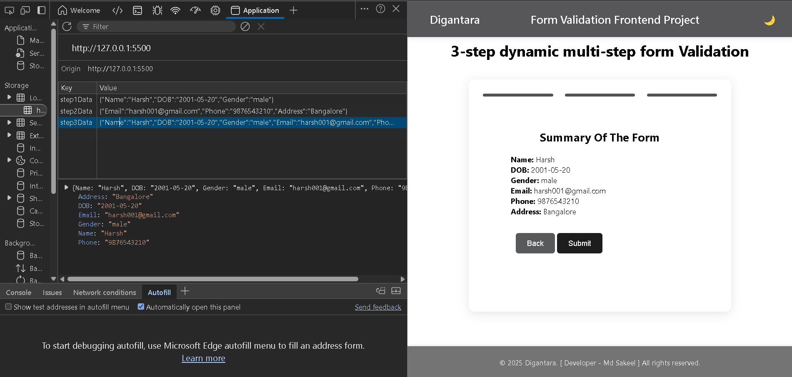
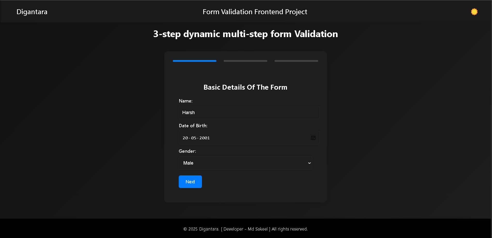
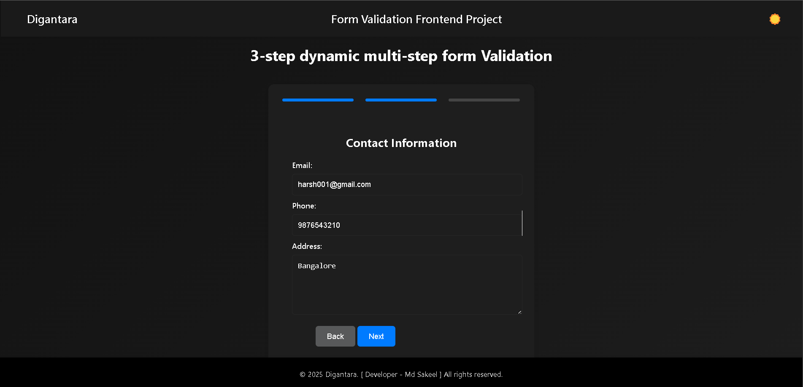
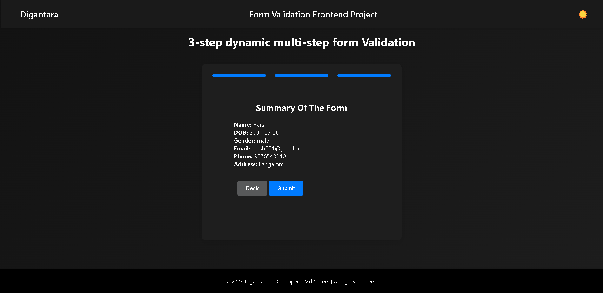

##      **Digantara Frontend Developer Assignment**

## **Project Overview**
```bash
   
   This project is a **3-step dynamic multi-step form** designed to collect user information. It includes features like navigation between steps, form validation, and a summary view before submission. The form is built using **HTML, CSS, and JavaScript**, with **TypeScript** for type safety and state management.

```

## **Features**
1. **Form Structure**:
   - **Step 1**: Collects basic details (Name, Date of Birth, Gender).
   - **Step 2**: Collects contact information (Email, Phone, Address).
   - **Step 3**: Displays a summary of the information entered in Steps 1 and 2, allowing users to confirm or edit before submitting.

2. **Validation**:
   - Validates inputs for each step (e.g., required fields, valid email format).
   - Highlights errors and provides user-friendly error messages.

3. **Dynamic Navigation**:
   - Includes “Next” and “Back” buttons to navigate between steps.
   - Allows users to edit data by navigating back to previous steps.

4. **State Management**:
   - Maintains form data across steps using **localStorage**.

5. **Persistence (Optional)**:
   - Saves progress in **localStorage** so users can resume the form after a refresh.

6. **Responsiveness**:
   - The form is fully responsive and works seamlessly across devices.

7. **TypeScript Integration**:
   - Uses TypeScript to define data models and manage state safely.

---

## **How to Set Up the Project**
1. **Clone the Repository**:

```bash
   git clone https://github.com/sakeel-103/Digantara-Assignment-Frontend.git
   cd digantara

```

2. **Install Dependencies:**:
    Install TypeScript globally
```
  npm install -g typescript

```  
3. **Compile the TypeScript:**:
   compilet script.ts to script.js

   ```
      tsc script.ts
   ```   

3. **Open the Project:**:

```bash   
   Open the index.html file in your browser to view the form

```

## **Design Decisions and Scalability/Usability Enhancements**

   ## ** Design Decisions **

   ```bash
      This project demonstrates a clean, modular, and scalable approach to building a multi-step form. By leveraging TypeScript for type safety, localStorage for state persistence, and responsive design principles, the form provides a seamless user experience. For a production-grade application, additional enhancements like API integration, accessibility improvements, and unit testing would further improve scalability and usability.

   ```

   ## ** Technologies Used **

   ```bash
      
      HTML:- For structuring the form.
      CSS:- For styling the form and making it responsive.
      JavaScript:- For form logic and interactivity.
      TypeScript:- For type safety and state management.
      localStorage:- For persisting form data across page refreshes.

   ```

   ## ** How to Run the Project **

   1. Open the index.html file in your browser.
   2. Fill out the form step-by-step.
   3. Review the summary in Step 3 and submit the form. 


   ## ** Screenshots **

   1. step - 1 for the basic details
   
        


   2. step - 2 this is a Contact Information page

      

   3.  step - 3   this is a summaary page of the form

       

       


##  ** Data Stored in localStorage  **

   1. Step - 1 

      

   2.  Step - 2

        

   3. Step - 3

          


## **  Bark-Mode **

1. Step - 1 
  
   

2. Step - 2

   

3. Step - 3

   

##  ** Conclusion **

```bash

   This README.md file provides a comprehensive overview of your project, including setup instructions, design decisions, and scalability enhancements. It also highlights your thought process and how you would improve the project for a production-grade application.

```    